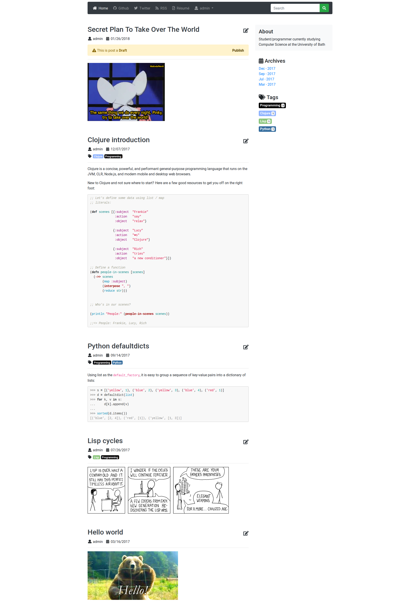

# Simple Django Blog

---

---

## Features

* Django 2.0+
* Python3.6
* Code syntax highlighting with Pygments
* RSS support
* Post archives
* Post tags

## TODO

* [ ] 100% Coverage
* [ ] Handle user uploaded static media files
* [ ] Docker integration
* [ ] User configuration file

# Installation

Create a virtual environment

    python -m venv env

Activate the virtual environment

    source env/bin/activate

Install the dependencies

    pip install -r requirements.txt

Tell Django which settings file to use

    export DJANGO_SETTINGS_MODULE=blog.settings.dev

Initialize the database

    ./manage.py makemigrations posts

    ./manage.py migrate

# Local Development

## Runserver

    ./manage.py runserver

## Running a test database

    ./manage.py testserver fixtures/db.json

# Running Tests

All Djagno tests can be ran with the following:

    ./manage.py test posts --settings=blog.settings.test

You may wish to pass some additional flags:

    ./manage.py test posts --failfast --settings=blog.settings.test

## Test Coverage

A coverage report can be generated with the following command:

    coverage run manage.py test posts --settings=blog.settings.test; and coverage report

# Screenshot

